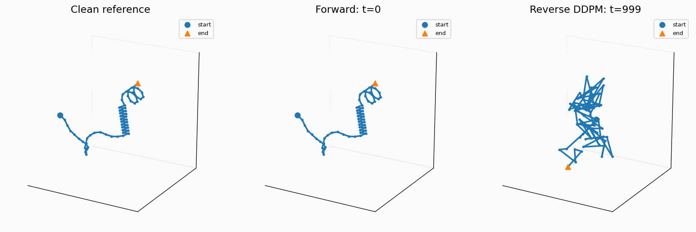
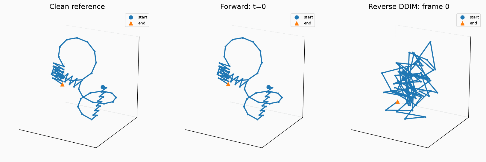

# Protein-inspired-3D-Diffusion

3D Diffusion for protein-inspired shapes. Train a Transformer denoiser on synthetic protein-like chains (helices, strands, coils), sample with DDPM/DDIM, and fine-tune with DDPO reinforcement learning to maximize structural rewards.

## DDPM & DDIM sampling with a Transformer denoiser

### DDPM


### DDIM


## Installation

```bash
git clone git@github.com:fin1cky/Protein-inspired-3D-Diffusion.git
cd Protein-inspired-3D-Diffusion

python -m venv .venv
source .venv/bin/activate

pip install -e ".[dev,viz]"
```

Supports **CUDA**, **MPS** (Apple Silicon), and **CPU**.

## Quick start

```python
import torch
from src import (
    set_seed, get_device,
    EpsChainTransformer, cosine_schedule, compute_posterior_variance,
    ddim_sample, project_bond_lengths, strandness_reward,
)

set_seed(42)
device = get_device()

# Load pretrained model
model = EpsChainTransformer(chain_len=64).to(device)
ckpt = torch.load("weights/baseline/chain_diffusion_transformer.pt", map_location=device, weights_only=False)
model.load_state_dict(ckpt["model"])

# Setup diffusion schedule
betas, alphas, alpha_bar = cosine_schedule(1000, device=device)

# Sample and evaluate
with torch.no_grad():
    samples = ddim_sample(model, 8, 64, alpha_bar, device=device, num_steps=100)
    projected = torch.stack([project_bond_lengths(s.cpu()) for s in samples])
    rewards = strandness_reward(projected)
    print(f"Mean strandness reward: {rewards.mean():.4f}")
```

## Project structure

```
├── src/                    # Python package
│   ├── utils.py            # set_seed, normalize, get_device
│   ├── geometry.py         # Bond vectors, tangents, extension ratio, batched ops
│   ├── chains.py           # Motif generators (helix/strand/coil), stitching
│   ├── dataset.py          # SyntheticChainDataset, create_dataloader
│   ├── diffusion.py        # Cosine schedule, q_sample, posterior variance
│   ├── models.py           # EpsChainMLP, EpsChainTransformer
│   ├── training.py         # train_step, train_step_tf
│   ├── sampling.py         # DDPM, DDIM, stable variants
│   ├── rewards.py          # Strandness reward (zig-zag alignment metrics)
│   ├── ddpo.py             # DDPO rollout collection, policy gradient updates
│   ├── evaluation.py       # Model evaluation, sample selection
│   └── visualization.py    # 3D plotting, GIF movie generation
├── notebooks/
│   └── 3D_diffusion.ipynb  # Full walkthrough notebook
├── weights/
│   ├── baseline/           # Pretrained transformer checkpoint
│   └── DDPO-SF/            # RL fine-tuned checkpoint
├── tests/
│   └── test_all.py         # 72 tests covering all modules
├── pyproject.toml
└── requirements.txt
```

## Pretrained weights

| Checkpoint | Path | Description |
|---|---|---|
| Baseline | `weights/baseline/chain_diffusion_transformer.pt` | Transformer trained on synthetic chains |
| DDPO | `weights/DDPO-SF/best_ddpo_diffusion.pt` | Fine-tuned to maximize strandness reward |

```python
# Baseline
ckpt = torch.load("weights/baseline/chain_diffusion_transformer.pt", map_location=device, weights_only=False)
model.load_state_dict(ckpt["model"])

# DDPO fine-tuned
ckpt = torch.load("weights/DDPO-SF/best_ddpo_diffusion.pt", map_location=device, weights_only=False)
model.load_state_dict(ckpt["model_state_dict"])
```

## Testing

```bash
python -m pytest tests/test_all.py -v
```

Covers utils, geometry, chain generation, dataset, diffusion, models, training, sampling, rewards, DDPO, evaluation, visualization, weight loading, and MPS device support.

## RL fine-tuning

DDPO (Denoising Diffusion Policy Optimization) reformulates the reverse diffusion process as an MDP and applies policy gradients to maximize a reward signal. The `strandness_reward` measures how well generated chains exhibit beta-sheet-like zig-zag geometry using adjacent bond anti-alignment and gap-2 alignment metrics.

```python
from src import (
    collect_ddpm_rollout_batch, ddpo_sf_update_step_anchor,
    strandness_reward, compute_posterior_variance,
)

# Collect trajectories and update
rollout = collect_ddpm_rollout_batch(
    model=model, n_samples=16, chain_len=64,
    betas=betas, alphas=alphas, alpha_bar=alpha_bar,
    posterior_var=compute_posterior_variance(betas, alpha_bar),
    reward_fn=strandness_reward, device=device,
)

stats = ddpo_sf_update_step_anchor(
    model=model, optimizer=optimizer, rollout_batch=rollout,
    betas=betas, alphas=alphas, alpha_bar=alpha_bar,
    posterior_var=compute_posterior_variance(betas, alpha_bar),
    anchor_batch=real_coords, anchor_coef=0.02,
)
```

## REFERENCES

[1] [Out of Many, One: Designing and Scaffolding Proteins at the Scale of the Structural Universe with Genie 2 - Lin, Lee et al.](https://arxiv.org/abs/2405.15489)  
[2] [Training Diffusion Models with Reinforcement Learning - Black et al.](https://arxiv.org/pdf/2305.13301)  
[3] [Simple statistical gradient-following algorithms for connectionist reinforcement learning. Reinforcement learning - Williams.](https://people.cs.umass.edu/~barto/courses/cs687/williams92simple.pdf)  
[4] [Monte carlo gradient estimation in machine learning. The Journal of Machine Learning Research - Mohamed et al.](https://jmlr.org/papers/volume21/19-346/19-346.pdf)

ChatGPT 5.4 Thinking, Claude Opus 4.6
